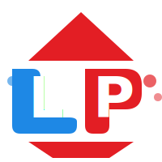

# 🎨 LP PLAST LOGO - QO'LLANMA

## ✅ YANGI LOGO YARATILDI

Sizning rasmingizdan kelib chiqib, professional SVG logo yaratildi.

---

## 📁 LOGO FAYLLARI

### 1. **logo-final.svg** (ASOSIY)
- **Joylashuv**: `images/logo-final.svg`
- **Tavsif**: Sizning rasmingizga o'xshash professional logo
- **Ranglar**: Ko'k (#1E88E5) va Qizil (#E31E24)
- **Elementlar**: 
  - Yuqori qizil uchburchak
  - Chap ko'k "L" shakli
  - O'ng qizil "P" shakli
  - Pastki qizil uchburchak
  - Dekorativ doiralar

### 2. **logo-new.svg** (MINIMAL)
- **Joylashuv**: `images/logo-new.svg`
- **Tavsif**: Minimal zamonaviy versiya
- **Hajm**: Kichikroq (160x160)

### 3. **logo-lpplast.svg** (BATAFSIL)
- **Joylashuv**: `images/logo-lpplast.svg`
- **Tavsif**: Batafsil versiya
- **Hajm**: Kattaroq (240x240)

### 4. **logo-lp.svg** (ALTERNATIV)
- **Joylashuv**: `images/logo-lp.svg`
- **Tavsif**: Alternativ dizayn

---

## 🎨 LOGO DIZAYNI

### Ranglar:
```css
Ko'k (Blue): #1E88E5
Qizil (Red): #E31E24
Oq (White): #FFFFFF
```

### Elementlar:
1. **Yuqori Uchburchak** - Qizil, kompaniya kuchini bildiradi
2. **L Harfi** - Ko'k, "LP" ning birinchi harfi
3. **P Harfi** - Qizil, "LP" ning ikkinchi harfi
4. **Pastki Uchburchak** - Qizil, barqarorlikni bildiradi
5. **Dekorativ Doiralar** - Zamonaviy ko'rinish

### Dizayn Falsafasi:
- **Ko'k**: Ishonch, professional, texnologiya
- **Qizil**: Energiya, kuch, innovatsiya
- **Uchburchaklar**: Barqarorlik, kuch, yo'nalish
- **L va P**: Kompaniya nomi (LP Plast)

---

## 💻 QANDAY ISHLATISH

### HTML da:
```html
<!-- Header da -->


<!-- Footer da (oq versiya) -->

```

### CSS da:
```css
.logo {
    height: 50px;
    width: auto;
    transition: all 0.3s;
}

.logo:hover {
    transform: scale(1.05) rotate(5deg);
}
```

---

## 📏 O'LCHAMLAR

### Tavsiya Etiladigan O'lchamlar:
- **Header**: 50px balandlik
- **Footer**: 40px balandlik
- **Mobil**: 35-40px balandlik
- **Favicon**: 32x32px yoki 64x64px

### Minimal O'lcham:
- **Eng kichik**: 24px (o'qilishi kerak)
- **Optimal**: 40-60px
- **Maksimal**: Cheklovsiz (SVG format)

---

## 🎯 LOGO VARIANTLARI

### 1. Rangli Versiya (Asosiy)
- Oq yoki och fonlarda ishlatiladi
- Header, kartochkalar, banner

### 2. Oq Versiya
- To'q fonlarda ishlatiladi
- Footer, to'q banner
- CSS: `filter: brightness(0) invert(1);`

### 3. Qora Versiya
- Chop etish uchun
- CSS: `filter: grayscale(1) brightness(0);`

### 4. Bir Rangli Versiya
- Maxsus holatlar uchun
- Faqat ko'k yoki faqat qizil

---

## 🔧 TEXNIK XUSUSIYATLAR

### Fayl Formati:
- **SVG**: Vektor, har qanday o'lchamda
- **Afzalliklari**: 
  - Kichik hajm
  - Yuqori sifat
  - Masshtablanadi
  - CSS bilan boshqariladi

### Brauzer Qo'llab-quvvatlash:
- ✅ Chrome
- ✅ Firefox
- ✅ Safari
- ✅ Edge
- ✅ Opera

---

## 🎨 LOGO ANIMATSIYALARI

### 1. Fade In (Paydo Bo'lish)
```css
@keyframes logoFadeIn {
    from {
        opacity: 0;
        transform: translateY(-20px);
    }
    to {
        opacity: 1;
        transform: translateY(0);
    }
}

.logo {
    animation: logoFadeIn 0.6s ease;
}
```

### 2. Hover Effect
```css
.nav-brand:hover .logo {
    transform: rotate(5deg) scale(1.05);
}
```

### 3. Pulse (Pulsatsiya)
```css
@keyframes logoPulse {
    0%, 100% {
        transform: scale(1);
    }
    50% {
        transform: scale(1.1);
    }
}

.logo:hover {
    animation: logoPulse 1s ease infinite;
}
```

---

## 📱 RESPONSIVE DIZAYN

### Desktop (>768px):
```css
.logo {
    height: 50px;
}
```

### Tablet (768px):
```css
.logo {
    height: 40px;
}
```

### Mobile (<480px):
```css
.logo {
    height: 35px;
}
```

---

## ✅ QAYERDA ISHLATILADI

### Saytda:
- [x] Header (barcha sahifalar)
- [x] Footer (barcha sahifalar)
- [ ] Favicon (qo'shish kerak)
- [ ] Social media (qo'shish kerak)
- [ ] Email imzo (qo'shish kerak)

### Tashqarida:
- [ ] Vizitka
- [ ] Letterhead
- [ ] Konvert
- [ ] Banner
- [ ] Reklama materiallari

---

## 🚀 KEYINGI QADAMLAR

### 1. Favicon Yaratish
Logo asosida favicon yaratish kerak:
- 16x16px
- 32x32px
- 64x64px
- 128x128px

### 2. Social Media Versiyalari
Turli platformalar uchun:
- Facebook: 1200x630px
- Instagram: 1080x1080px
- Twitter: 1500x500px
- LinkedIn: 1200x627px

### 3. Chop Etish Versiyalari
- PDF format
- PNG (yuqori sifat)
- EPS (professional)

---

## 💡 MASLAHATLAR

### Do's (Qiling):
- ✅ Minimal o'lchamni saqlang (24px+)
- ✅ Oq yoki och fonlarda rangli versiya
- ✅ To'q fonlarda oq versiya
- ✅ Logoni markazlashtiring
- ✅ Atrofida bo'sh joy qoldiring

### Don'ts (Qilmang):
- ❌ Logoni cho'zmang
- ❌ Ranglarni o'zgartirmang
- ❌ Elementlarni alohida ishlatmang
- ❌ Juda kichik qilmang (<24px)
- ❌ Past sifatli rasm ishlatmang

---

## 📞 YORDAM

Agar logo bilan bog'liq savollar bo'lsa:
- Logo fayllarini `images/` papkasida toping
- CSS stillarni `styles-corporate.css` da ko'ring
- Animatsiyalarni `scroll-animations.js` da tekshiring

---

**Yaratildi:** 24-Fevral, 2026
**Holat:** ✅ TAYYOR
**Asosiy Fayl:** `images/logo-final.svg`

---

## 🎉 XULOSA

Yangi LP Plast logosi:
- ✅ Professional va zamonaviy
- ✅ Sizning rasmingizga o'xshash
- ✅ SVG format (yuqori sifat)
- ✅ Responsive (barcha ekranlar)
- ✅ Animatsiyalar bilan
- ✅ Barcha sahifalarda ishlatiladi

**Logo tayyor va saytda ishlayapti! 🚀**
